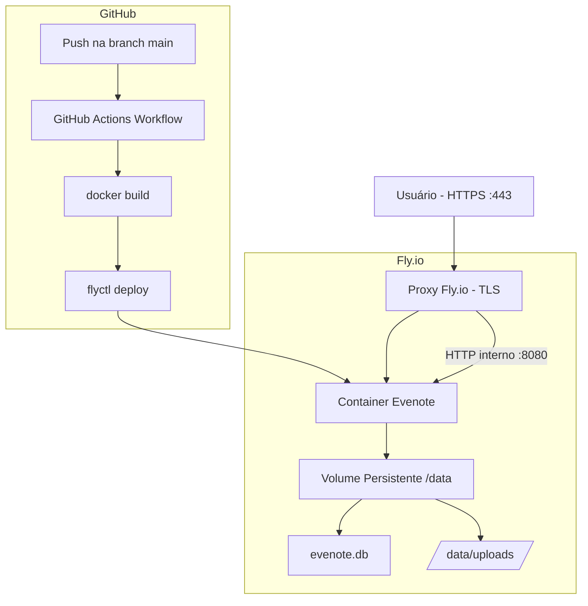

# Documento de Design — Deploy na Nuvem (Fly.io)

## Visão Geral

Este documento descreve o design técnico para hospedar o Evenote (Blazor Server, .NET 10, SQLite) na plataforma Fly.io. A solução envolve quatro mudanças principais:

1. **Correção do Dockerfile** — atualizar de .NET 8 para .NET 10 e corrigir o nome do binário.
2. **Configuração do Fly.io** — criar `fly.toml` com volume persistente em `/data` para banco de dados e uploads.
3. **Adaptação do `Program.cs`** — tornar os caminhos do banco de dados e uploads configuráveis via variáveis de ambiente.
4. **Pipeline CI/CD** — criar workflow do GitHub Actions para deploy automático a cada push na branch principal.

O HTTPS é delegado inteiramente ao proxy reverso do Fly.io, eliminando a necessidade de gerenciar certificados TLS dentro do container.

---

## Arquitetura



**Fluxo de dados:**
- O usuário acessa via HTTPS na porta 443.
- O proxy do Fly.io termina o TLS e encaminha a requisição para o container na porta 8080 via HTTP.
- O container lê e escreve dados no volume persistente montado em `/data`.
- O GitHub Actions constrói a imagem Docker e faz deploy no Fly.io a cada push na `main`.

---

## Componentes e Interfaces

### 1. Dockerfile (corrigido)

Responsável por empacotar o Evenote em uma imagem Docker otimizada com build multi-estágio.

**Mudanças em relação ao Dockerfile atual:**
- `sdk:8.0` → `sdk:10.0`
- `aspnet:8.0` → `aspnet:10.0`
- `Evernote.dll` → `Evenote.dll`

```dockerfile
# ── Etapa 1: Build ──────────────────────────────────────────────────────────
FROM mcr.microsoft.com/dotnet/sdk:10.0 AS build
WORKDIR /src

# Restaura dependências antes de copiar o restante (cache de camadas)
COPY Evenote.csproj ./
RUN dotnet restore

# Copia o restante e publica em modo Release
COPY . .
RUN dotnet publish Evenote.csproj -c Release -o /app/out --no-restore

# ── Etapa 2: Runtime ─────────────────────────────────────────────────────────
FROM mcr.microsoft.com/dotnet/aspnet:10.0 AS runtime
WORKDIR /app

# Cria o diretório de dados (será sobrescrito pelo volume do Fly.io)
RUN mkdir -p /data/uploads

COPY --from=build /app/out .

ENV ASPNETCORE_URLS=http://+:8080
ENV ASPNETCORE_ENVIRONMENT=Production
ENV DATABASE_PATH=/data/evenote.db
ENV UPLOADS_PATH=/data/uploads

EXPOSE 8080

ENTRYPOINT ["dotnet", "Evenote.dll"]
```

**Decisões de design:**
- A restauração de dependências é feita antes de copiar o código-fonte para aproveitar o cache de camadas do Docker — rebuilds são mais rápidos quando apenas o código muda.
- Os valores padrão de `DATABASE_PATH` e `UPLOADS_PATH` são definidos no Dockerfile para que a imagem funcione corretamente mesmo sem o `fly.toml` (ex.: testes locais com `docker run`).
- `ASPNETCORE_ENVIRONMENT=Production` garante que o comportamento de produção seja ativado por padrão no container.

---

### 2. fly.toml

Arquivo de configuração declarativa do Fly.io. Define a aplicação, portas, volume persistente, variáveis de ambiente e health check.

```toml
# fly.toml — Configuração do Evenote no Fly.io
app = "evenote"
primary_region = "gru"  # São Paulo

[build]
  dockerfile = "Dockerfile"

[env]
  ASPNETCORE_ENVIRONMENT = "Production"
  DATABASE_PATH          = "/data/evenote.db"
  UPLOADS_PATH           = "/data/uploads"

[[mounts]]
  source      = "evenote_data"
  destination = "/data"

[[services]]
  internal_port = 8080
  protocol      = "tcp"

  [[services.ports]]
    handlers = ["http"]
    port     = 80
    force_https = true

  [[services.ports]]
    handlers = ["tls", "http"]
    port     = 443

  [services.concurrency]
    type       = "connections"
    hard_limit = 25
    soft_limit = 20

  [[services.http_checks]]
    interval      = 10000   # ms
    timeout       = 5000    # ms
    grace_period  = "30s"
    method        = "GET"
    path          = "/"
    protocol      = "http"
    restart_limit = 0
```

**Decisões de design:**
- `primary_region = "gru"` coloca o app em São Paulo, minimizando latência para usuários brasileiros.
- `force_https = true` no handler HTTP garante redirecionamento automático de HTTP para HTTPS pelo proxy do Fly.io, sem nenhuma lógica no código da aplicação.
- O volume `evenote_data` é criado uma única vez via `fly volumes create evenote_data --size 1` e persiste entre deploys e reinicializações.
- O health check no endpoint `/` com `grace_period = "30s"` dá tempo suficiente para as migrations do EF Core serem aplicadas na inicialização.

---

### 3. Program.cs (adaptado)

As mudanças no `Program.cs` são cirúrgicas: apenas a resolução dos caminhos do banco de dados e dos uploads passa a ler variáveis de ambiente, preservando todo o comportamento existente.

**Mudanças necessárias:**

```csharp
// ANTES (linha atual):
var dbPath = Path.Combine(builder.Environment.ContentRootPath, "evenote.db");

// DEPOIS:
var dbPath = Environment.GetEnvironmentVariable("DATABASE_PATH")
    ?? Path.Combine(builder.Environment.ContentRootPath, "evenote.db");

// Garante que o diretório do banco existe
Directory.CreateDirectory(Path.GetDirectoryName(dbPath)!);
```

```csharp
// ANTES (endpoint /uploads/{*filename}):
var webRoot = env.WebRootPath ?? Path.Combine(env.ContentRootPath, "wwwroot");
var filePath = Path.Combine(webRoot, "uploads", Uri.UnescapeDataString(filename));

// DEPOIS:
var uploadsBase = Environment.GetEnvironmentVariable("UPLOADS_PATH")
    ?? Path.Combine(env.WebRootPath ?? Path.Combine(env.ContentRootPath, "wwwroot"), "uploads");
var filePath = Path.Combine(uploadsBase, Uri.UnescapeDataString(filename));
```

```csharp
// ANTES (UseHttpsRedirection — remover ou condicionar):
app.UseHttpsRedirection();  // ← remover esta linha

// DEPOIS: sem UseHttpsRedirection
// O TLS é gerenciado pelo proxy do Fly.io; dentro do container trafega apenas HTTP.
```

**`Program.cs` completo após as mudanças:**

```csharp
using Evenote.Components;
using Evenote.Data;
using Evenote.Services;
using Microsoft.EntityFrameworkCore;

var builder = WebApplication.CreateBuilder(args);

// Add services to the container.
builder.Services.AddRazorComponents()
    .AddInteractiveServerComponents()
    .AddHubOptions(options => options.MaximumReceiveMessageSize = 100 * 1024 * 1024); // 100 MB

// Banco de dados SQLite — caminho configurável via DATABASE_PATH
var dbPath = Environment.GetEnvironmentVariable("DATABASE_PATH")
    ?? Path.Combine(builder.Environment.ContentRootPath, "evenote.db");

// Garante que o diretório do banco existe (necessário no Fly.io antes da primeira execução)
Directory.CreateDirectory(Path.GetDirectoryName(dbPath)!);

builder.Services.AddDbContext<AppDbContext>(options =>
    options.UseSqlite($"Data Source={dbPath}"));

// Scoped = uma instância por conexão SignalR (por aba do browser)
builder.Services.AddScoped<NotaService>();
builder.Services.AddScoped<TarefaService>();
builder.Services.AddScoped<CalendarioService>();
builder.Services.AddScoped<GravacaoTelaService>();
builder.Services.AddHostedService<LembreteTarefaService>();

builder.Services.AddControllers();

var app = builder.Build();

// Aplica migrations e semeia o Caderno Principal na primeira execução
using (var scope = app.Services.CreateScope())
{
    var db = scope.ServiceProvider.GetRequiredService<AppDbContext>();
    var logger = scope.ServiceProvider.GetRequiredService<ILogger<AppDbContext>>();

    var pendingMigrations = db.Database.GetPendingMigrations().ToList();
    if (pendingMigrations.Count > 0)
    {
        logger.LogInformation("Aplicando {Count} migration(s): {Migrations}",
            pendingMigrations.Count, string.Join(", ", pendingMigrations));
    }

    db.Database.Migrate();

    if (!db.Cadernos.Any())
    {
        db.Cadernos.Add(new Caderno { Nome = "Caderno Principal" });
        db.SaveChanges();
    }

    if (!db.Calendarios.Any())
    {
        db.Calendarios.Add(new CalendarioLocal { Nome = "Alexandre Mello", Cor = "#f4a54a" });
        db.SaveChanges();
    }
}

// Configure the HTTP request pipeline.
if (!app.Environment.IsDevelopment())
{
    app.UseExceptionHandler("/Error", createScopeForErrors: true);
    app.UseHsts();
}

// HTTPS é gerenciado pelo proxy do Fly.io — não usar UseHttpsRedirection no container
// app.UseHttpsRedirection();  ← removido intencionalmente

app.UseStatusCodePagesWithReExecute("/not-found", createScopeForStatusCodePages: true);
app.UseStaticFiles();

app.UseAntiforgery();

// Endpoint dedicado para servir arquivos de upload
// Caminho configurável via UPLOADS_PATH (padrão: {WebRootPath}/uploads)
app.MapGet("/uploads/{*filename}", (string filename, IWebHostEnvironment env) =>
{
    var uploadsBase = Environment.GetEnvironmentVariable("UPLOADS_PATH")
        ?? Path.Combine(
            env.WebRootPath ?? Path.Combine(env.ContentRootPath, "wwwroot"),
            "uploads");

    var filePath = Path.Combine(uploadsBase, Uri.UnescapeDataString(filename));

    if (!File.Exists(filePath)) return Results.NotFound();

    var contentType = Path.GetExtension(filePath).ToLower() switch
    {
        ".pdf"              => "application/pdf",
        ".jpg" or ".jpeg"   => "image/jpeg",
        ".png"              => "image/png",
        ".gif"              => "image/gif",
        ".webp"             => "image/webp",
        ".webm"             => "video/webm",
        _                   => "application/octet-stream"
    };
    return Results.File(filePath, contentType, enableRangeProcessing: true);
});

app.MapStaticAssets();
app.MapControllers();
app.MapRazorComponents<App>()
    .AddInteractiveServerRenderMode();

app.Run();
```

**Decisões de design:**
- A lógica de fallback (`?? caminho_padrão`) garante que o comportamento em desenvolvimento local seja idêntico ao atual — nenhuma variável de ambiente precisa ser configurada localmente.
- `Directory.CreateDirectory` é idempotente: não falha se o diretório já existir.
- O logging de migrations usa `ILogger` estruturado, compatível com o sistema de logs do Fly.io.
- `UseHttpsRedirection` é removido porque dentro do container o tráfego é sempre HTTP; o proxy do Fly.io já garante HTTPS externamente.

---

### 4. GitHub Actions — deploy.yml

Pipeline de CI/CD que constrói a imagem Docker e faz deploy no Fly.io a cada push na branch principal.

```yaml
# .github/workflows/deploy.yml
name: Deploy no Fly.io

on:
  push:
    branches:
      - main
      - master

jobs:
  deploy:
    name: Build e Deploy
    runs-on: ubuntu-latest
    concurrency:
      group: deploy-production
      cancel-in-progress: true

    steps:
      - name: Checkout do repositório
        uses: actions/checkout@v4

      - name: Instalar flyctl
        uses: superfly/flyctl-actions/setup-flyctl@master

      - name: Deploy no Fly.io
        run: flyctl deploy --remote-only
        env:
          FLY_API_TOKEN: ${{ secrets.FLY_API_TOKEN }}

      - name: Exibir URL da aplicação
        run: flyctl status --json | jq -r '"URL: https://" + .Hostname'
        env:
          FLY_API_TOKEN: ${{ secrets.FLY_API_TOKEN }}
```

**Decisões de design:**
- `--remote-only` delega o build Docker para os builders remotos do Fly.io, evitando o custo de tempo de construir a imagem no runner do GitHub Actions e depois transferi-la.
- `concurrency.cancel-in-progress: true` cancela deploys anteriores em andamento quando um novo push chega, evitando deploys desatualizados.
- O `FLY_API_TOKEN` é referenciado exclusivamente via `${{ secrets.FLY_API_TOKEN }}` — o GitHub Actions mascara automaticamente o valor em todos os logs.
- O step final usa `flyctl status --json | jq` para exibir a URL pública de forma legível no log do workflow.

---

## Modelos de Dados

Nenhuma alteração nos modelos de dados do EF Core é necessária. As mudanças são exclusivamente de infraestrutura (onde o arquivo `evenote.db` é armazenado, não sua estrutura).

**Localização do banco de dados por ambiente:**

| Ambiente | Variável `DATABASE_PATH` | Caminho efetivo |
|---|---|---|
| Desenvolvimento local | não definida | `{ContentRootPath}/evenote.db` |
| Container Docker (padrão) | `/data/evenote.db` | `/data/evenote.db` |
| Fly.io (volume montado) | `/data/evenote.db` | `/data/evenote.db` (volume persistente) |

**Localização dos uploads por ambiente:**

| Ambiente | Variável `UPLOADS_PATH` | Caminho efetivo |
|---|---|---|
| Desenvolvimento local | não definida | `{WebRootPath}/uploads/` |
| Container Docker (padrão) | `/data/uploads` | `/data/uploads/` |
| Fly.io (volume montado) | `/data/uploads` | `/data/uploads/` (volume persistente) |

---

## Propriedades de Corretude

*Uma propriedade é uma característica ou comportamento que deve ser verdadeiro em todas as execuções válidas de um sistema — essencialmente, uma declaração formal sobre o que o sistema deve fazer. Propriedades servem como ponte entre especificações legíveis por humanos e garantias de corretude verificáveis por máquinas.*

A maioria dos requisitos desta feature é de configuração de infraestrutura (Dockerfile, fly.toml, deploy.yml), para os quais testes de propriedade não são apropriados. No entanto, a lógica de resolução de caminhos no `Program.cs` é código puro que se beneficia de testes de propriedade.

### Propriedade 1: Resolução do caminho do banco de dados

*Para qualquer* string de caminho absoluto válida definida em `DATABASE_PATH`, o connection string do `DbContext` deve usar exatamente esse caminho como `Data Source`.

**Valida: Requisitos 2.3, 2.8, 3.1**

### Propriedade 2: Resolução do caminho de uploads

*Para qualquer* string de caminho absoluto válida definida em `UPLOADS_PATH`, o endpoint `/uploads/{filename}` deve buscar o arquivo concatenando `UPLOADS_PATH` com o nome do arquivo, sem usar o `WebRootPath`.

**Valida: Requisitos 2.4, 3.3**

### Propriedade 3: Criação de diretórios na inicialização

*Para qualquer* caminho de diretório válido (que o processo tenha permissão de criar) definido em `DATABASE_PATH` ou `UPLOADS_PATH`, após a inicialização do app o diretório pai deve existir no sistema de arquivos.

**Valida: Requisito 3.5**

### Propriedade 4: Fallback para caminhos padrão

*Para qualquer* configuração onde `DATABASE_PATH` não está definida, o caminho do banco de dados deve ser `{ContentRootPath}/evenote.db`; e onde `UPLOADS_PATH` não está definida, o caminho de uploads deve ser `{WebRootPath}/uploads`.

**Valida: Requisitos 3.2, 3.4**

### Propriedade 5: Logging de migrations

*Para qualquer* lista não vazia de migrations pendentes, após a chamada a `db.Database.Migrate()`, cada migration da lista deve ter sido registrada no log com nível `Information`.

**Valida: Requisito 6.2**

---

## Tratamento de Erros

### Falha no volume persistente

Se o diretório `/data` não estiver montado (volume não criado ou não montado), `Directory.CreateDirectory` tentará criar o diretório dentro do container efêmero. O banco de dados funcionará, mas os dados serão perdidos no próximo deploy. Para detectar esse cenário, o operador deve verificar se o volume está listado em `fly volumes list`.

**Mitigação:** Documentar o passo `fly volumes create evenote_data --size 1` como pré-requisito obrigatório antes do primeiro deploy.

### Falha nas migrations

Se uma migration falhar (ex.: banco corrompido, permissão negada), a exceção do EF Core será propagada e o app encerrará com código de saída diferente de zero. O Fly.io detectará a falha no health check e não substituirá a versão anterior em execução.

### Falha no build Docker (CI/CD)

O GitHub Actions interrompe o workflow automaticamente se qualquer step retornar código de saída diferente de zero. O step `flyctl deploy` só é executado se o build for bem-sucedido.

### Token de API inválido ou expirado

Se `FLY_API_TOKEN` for inválido, `flyctl deploy` retornará erro com mensagem descritiva. O workflow falhará e o operador receberá notificação por e-mail do GitHub.

---

## Estratégia de Testes

### Testes de smoke (verificação estática)

Verificações de conteúdo dos arquivos de configuração — podem ser executadas como parte do CI antes do deploy:

- Dockerfile usa `sdk:10.0` e `aspnet:10.0`
- Dockerfile referencia `Evenote.dll` no `ENTRYPOINT`
- `fly.toml` declara volume montado em `/data`
- `fly.toml` configura `force_https = true`
- `deploy.yml` referencia `secrets.FLY_API_TOKEN`

### Testes unitários (exemplos)

- Sem `DATABASE_PATH` definida → caminho padrão `{ContentRootPath}/evenote.db` é usado
- Sem `UPLOADS_PATH` definida → caminho padrão `{WebRootPath}/uploads` é usado
- `UseHttpsRedirection` não é chamado no pipeline de middleware

### Testes de propriedade

Usar a biblioteca **xUnit** com **FsCheck** (ou **CsCheck**) para os testes de propriedade:

- **Propriedade 1** — Gerar caminhos absolutos aleatórios válidos, definir como `DATABASE_PATH`, verificar que o connection string do DbContext contém exatamente esse caminho.
- **Propriedade 2** — Gerar caminhos absolutos aleatórios válidos, definir como `UPLOADS_PATH`, verificar que o endpoint de uploads concatena corretamente com o nome do arquivo.
- **Propriedade 3** — Gerar caminhos de diretório aleatórios em um diretório temporário, verificar que após a inicialização o diretório existe.
- **Propriedade 4** — Verificar comportamento de fallback com e sem variáveis de ambiente definidas.
- **Propriedade 5** — Gerar listas aleatórias de nomes de migration, verificar que todos aparecem no log após `Migrate()`.

Cada teste de propriedade deve executar no mínimo **100 iterações**.

Tag de referência: `Feature: cloud-deploy, Property {N}: {texto_da_propriedade}`

### Testes de integração

- Build da imagem Docker localmente com `docker build` e verificação de que o container inicia sem erros.
- Verificação pós-deploy de que a URL pública responde com HTTP 200 via HTTPS.
- Verificação de que dados persistem após `fly deploy` (criar uma nota, fazer deploy, verificar que a nota ainda existe).

### Pré-requisitos para o primeiro deploy

```bash
# 1. Instalar flyctl
curl -L https://fly.io/install.sh | sh

# 2. Autenticar
fly auth login

# 3. Criar a aplicação (apenas uma vez)
fly launch --no-deploy

# 4. Criar o volume persistente (apenas uma vez)
fly volumes create evenote_data --size 1 --region gru

# 5. Configurar o secret do token no GitHub
# Settings → Secrets → Actions → New repository secret
# Nome: FLY_API_TOKEN
# Valor: $(fly auth token)

# 6. Primeiro deploy manual (opcional)
fly deploy
```
