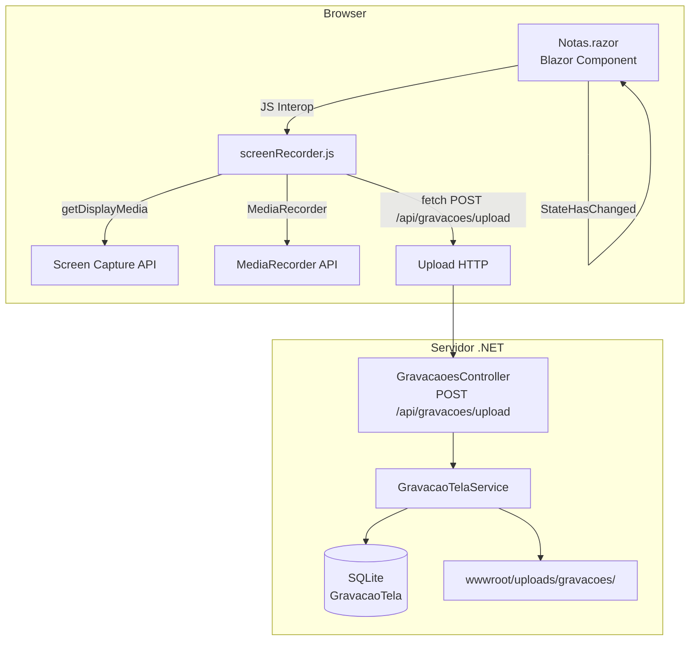

# Design Document — Gravação de Tela

## Overview

A funcionalidade de gravação de tela permite ao usuário capturar o conteúdo da tela diretamente a partir do editor de notas do Evenote, sem sair do contexto da nota. A gravação é controlada por um modal flutuante, salva no servidor em formato WebM e exibida inline na nota como um player HTML5 nativo.

A implementação envolve três camadas:

1. **JavaScript (browser)** — interage com a Screen Capture API (`getDisplayMedia`) e a `MediaRecorder` API, gerencia o ciclo de vida da gravação e faz o upload do arquivo ao servidor.
2. **Blazor Server (.NET 10)** — componente `Notas.razor` estendido com o modal de gravação e a seção de exibição de gravações; endpoint de upload; serviço `GravacaoTelaService`.
3. **Banco de dados (SQLite + EF Core)** — entidade `GravacaoTela` com chave estrangeira para `Nota` e exclusão em cascata.

---

## Architecture



**Fluxo principal:**

1. Usuário clica em "Gravar tela" no Menu Inserir.
2. `Notas.razor` invoca `screenRecorder.iniciar()` via JS Interop.
3. O JS solicita permissão via `getDisplayMedia`; se concedida, inicia `MediaRecorder` e exibe o modal.
4. O cronômetro é atualizado a cada segundo via `setInterval`; callbacks JS→.NET atualizam o estado do Blazor.
5. Ao parar, o JS consolida os chunks em um `Blob` WebM e faz `fetch POST` para `/api/gravacoes/upload`.
6. O controller recebe o arquivo, delega ao `GravacaoTelaService` que salva o arquivo e persiste o registro.
7. O controller retorna o objeto `GravacaoTela` serializado; o Blazor atualiza a lista de gravações da nota.

---

## Components and Interfaces

### 1. `screenRecorder.js` (novo arquivo em `wwwroot/js/`)

Módulo JavaScript exposto como `window.screenRecorder` com as seguintes funções:

```js
screenRecorder.verificarSuporteAsync()   // → Promise<bool>
screenRecorder.iniciarAsync(dotNetRef)   // → Promise<void>  — solicita permissão e inicia gravação
screenRecorder.pausar()                  // → void
screenRecorder.retomar()                 // → void
screenRecorder.pararAsync()              // → Promise<void>  — consolida e faz upload
screenRecorder.cancelar()               // → void           — descarta gravação sem upload
```

Callbacks invocados via `dotNetRef.invokeMethodAsync`:

| Callback .NET | Quando é chamado |
|---|---|
| `GravacaoIniciada` | Permissão concedida, gravação começou |
| `GravacaoPausada` | Gravação pausada |
| `GravacaoRetomada` | Gravação retomada |
| `GravacaoParada` | Upload concluído com sucesso — recebe `GravacaoTelaDto` |
| `GravacaoErro` | Qualquer erro — recebe mensagem string |
| `TickCronometro` | A cada segundo — recebe segundos decorridos (int) |

### 2. `GravacaoTelaService` (novo em `Services/`)

```csharp
public class GravacaoTelaService
{
    Task<GravacaoTela> SalvarGravacaoAsync(
        Guid notaId, IFormFile arquivo, string nomeOriginal);

    Task<List<GravacaoTela>> ObterPorNotaAsync(Guid notaId);

    Task ExcluirGravacaoAsync(Guid id);

    Task ExcluirPorNotaAsync(Guid notaId);   // usado na exclusão definitiva da nota
}
```

### 3. `GravacaoesController` (novo em `Controllers/`)

```
POST /api/gravacoes/upload
  Body: multipart/form-data { notaId: Guid, arquivo: IFormFile }
  Response 200: GravacaoTelaDto
  Response 400: { erro: string }

DELETE /api/gravacoes/{id}
  Response 204
```

### 4. `Notas.razor` — extensões

- Novo item "Gravar tela" no `menu-inserir-dropdown`.
- Novo bloco `Modal_Gravacao` renderizado condicionalmente.
- Nova seção "Gravações de tela" abaixo do PDF, renderizada quando `_gravacoes.Count > 0`.
- Novos campos de estado: `_gravacoes`, `_estadoGravacao`, `_segundosGravacao`, `_erroGravacao`.
- Novos métodos `[JSInvokable]`: `GravacaoIniciada`, `GravacaoPausada`, `GravacaoRetomada`, `GravacaoParada`, `GravacaoErro`, `TickCronometro`.

---

## Data Models

### Entidade `GravacaoTela`

```csharp
public class GravacaoTela
{
    public Guid Id { get; set; } = Guid.NewGuid();
    public Guid NotaId { get; set; }
    public string CaminhoArquivo { get; set; } = "";   // caminho relativo em wwwroot
    public string NomeOriginal { get; set; } = "";
    public long TamanhoBytes { get; set; }
    public DateTime CriadoEm { get; set; } = DateTime.Now;
}
```

### DTO de resposta

```csharp
public record GravacaoTelaDto(
    Guid Id,
    Guid NotaId,
    string CaminhoArquivo,
    string NomeOriginal,
    long TamanhoBytes,
    DateTime CriadoEm
);
```

### Migração EF Core

- Adicionar `DbSet<GravacaoTela>` em `AppDbContext`.
- Configurar `OnDelete(DeleteBehavior.Cascade)` na relação `GravacaoTela → Nota`.
- Gerar migration `AddGravacaoTela`.

### Convenção de nomes de arquivo

```
{notaId}_{yyyyMMddHHmmss}_{guid-curto}.webm
```

Exemplo: `3fa85f64-5717-4562-b3fc-2c963f66afa6_20260415143022_a1b2.webm`

---

## Correctness Properties

*Uma propriedade é uma característica ou comportamento que deve ser verdadeiro em todas as execuções válidas do sistema — essencialmente, uma declaração formal sobre o que o sistema deve fazer. Propriedades servem como ponte entre especificações legíveis por humanos e garantias de correção verificáveis por máquina.*

### Property 1: Formatação do cronômetro sempre produz MM:SS válido

*Para qualquer* número inteiro não-negativo de segundos decorridos, a função de formatação do cronômetro deve produzir uma string no formato `MM:SS` onde MM e SS são inteiros não-negativos, SS está no intervalo [0, 59] e MM representa os minutos completos.

**Validates: Requirements 2.2**

---

### Property 2: Nome de arquivo gerado é único e contém o NotaId

*Para qualquer* `Guid` de nota e dois timestamps distintos, os nomes de arquivo gerados devem ser diferentes entre si e ambos devem conter a representação string do `NotaId`.

**Validates: Requirements 3.2**

---

### Property 3: GravacaoTela criada possui todos os campos obrigatórios válidos

*Para qualquer* gravação salva com sucesso pelo `GravacaoTelaService`, o objeto `GravacaoTela` resultante deve ter: `Id` diferente de `Guid.Empty`, `NotaId` igual ao id da nota fornecida, `CaminhoArquivo` não vazio, `NomeOriginal` não vazio, `TamanhoBytes` maior que zero e `CriadoEm` definido.

**Validates: Requirements 3.3, 3.4**

---

### Property 4: Formatação de tamanho de arquivo produz string legível com unidade

*Para qualquer* valor de `TamanhoBytes` não-negativo, a função de formatação deve produzir uma string não vazia que contenha exatamente uma das unidades: "B", "KB", "MB" ou "GB", e o valor numérico deve ser consistente com o tamanho fornecido.

**Validates: Requirements 4.4**

---

### Property 5: Cada gravação é renderizada com player, botão de download e botão de exclusão

*Para qualquer* lista não-vazia de `GravacaoTela` associadas a uma nota, a seção de gravações deve renderizar exatamente N itens, cada um contendo um elemento `<video>` com atributo `controls`, um elemento de download com o `NomeOriginal` e um botão de exclusão.

**Validates: Requirements 4.2, 4.3, 5.1, 6.1**

---

### Property 6: Exclusão de gravação remove o registro do banco

*Para qualquer* `GravacaoTela` existente no banco, após chamar `ExcluirGravacaoAsync(id)`, nenhuma gravação com aquele `Id` deve existir na base de dados.

**Validates: Requirements 6.3**

---

### Property 7: Mover nota para lixeira preserva todas as gravações associadas

*Para qualquer* nota com N gravações associadas, após `MoverParaLixeira`, o número de registros `GravacaoTela` com aquele `NotaId` deve permanecer N.

**Validates: Requirements 7.1**

---

### Property 8: Exclusão definitiva da nota remove todas as gravações em cascata

*Para qualquer* nota com N gravações associadas (N ≥ 0), após `ExcluirDefinitivamente`, nenhum registro `GravacaoTela` com aquele `NotaId` deve existir no banco de dados.

**Validates: Requirements 7.2, 7.3**

---

## Error Handling

| Cenário | Comportamento |
|---|---|
| Browser não suporta `getDisplayMedia` | Item "Gravar tela" oculto no menu Inserir |
| Usuário nega permissão de captura | Modal não abre; mensagem de erro exibida inline |
| Stream de captura encerrada pelo usuário (ex.: clicou "Parar compartilhamento" no browser) | Gravação é finalizada automaticamente como se o usuário tivesse clicado "Parar" |
| Falha no upload HTTP | Modal exibe mensagem de erro descritiva; blob WebM mantido em memória para nova tentativa |
| Arquivo físico ausente na exclusão | `GravacaoTelaService` remove apenas o registro do banco, sem lançar exceção |
| Nota excluída definitivamente | Cascade delete remove todos os registros `GravacaoTela`; `GravacaoTelaService.ExcluirPorNotaAsync` remove os arquivos físicos antes da exclusão do banco |

**Tratamento de erros no JS:**

- Todos os métodos async do `screenRecorder.js` têm `try/catch` que invocam `GravacaoErro` via `dotNetRef`.
- O evento `MediaRecorder.onerror` e o evento `stream.oninactive` (stream encerrada externamente) são tratados explicitamente.

**Tratamento de erros no servidor:**

- O controller retorna `400 Bad Request` com mensagem descritiva para uploads inválidos (arquivo ausente, `notaId` inválido, tipo MIME incorreto).
- O `GravacaoTelaService` usa `try/catch` ao deletar arquivos físicos para não propagar `IOException` quando o arquivo não existe.

---

## Testing Strategy

### Abordagem dual

A estratégia combina testes de exemplo (unitários) para comportamentos específicos e testes baseados em propriedades para invariantes universais.

### Biblioteca de PBT

**FsCheck** (via `FsCheck.Xunit`) — biblioteca de property-based testing madura para .NET, com suporte a geradores customizados e integração com xUnit.

### Testes de propriedade

Cada propriedade do design deve ser implementada como um único teste FsCheck com mínimo de 100 iterações. Tag de referência no comentário do teste:

```
// Feature: screen-recording, Property N: <texto da propriedade>
```

| Propriedade | O que varia | O que é verificado |
|---|---|---|
| P1 — Formatação MM:SS | Segundos (0 a 5999) | Formato correto, SS ∈ [0,59] |
| P2 — Nome de arquivo único | Guid de nota, pares de timestamps distintos | Nomes diferentes, ambos contêm NotaId |
| P3 — Campos obrigatórios | Guid de nota, tamanho de arquivo | Todos os campos preenchidos e válidos |
| P4 — Formatação de tamanho | TamanhoBytes (0 a long.MaxValue) | String com unidade correta |
| P5 — Renderização completa | Lista de GravacaoTela (1 a 20 itens) | N players, N botões baixar, N botões excluir |
| P6 — Exclusão remove registro | GravacaoTela aleatória | Registro ausente após exclusão |
| P7 — Lixeira preserva gravações | Nota com 0–10 gravações | Contagem inalterada após MoverParaLixeira |
| P8 — Cascade delete | Nota com 0–10 gravações | Contagem zero após ExcluirDefinitivamente |

### Testes de exemplo (unitários)

- Menu Inserir exibe "Gravar tela" quando nota está selecionada.
- Menu Inserir oculta "Gravar tela" quando `getDisplayMedia` não está disponível.
- Modal exibe controles corretos em cada estado (gravando, pausado).
- Mensagem de erro exibida ao negar permissão.
- Mensagem de erro exibida ao falhar upload.
- Player de vídeo aparece após upload bem-sucedido.
- Diálogo de confirmação exibido ao clicar em Excluir.
- Download usa `NomeOriginal` como nome do arquivo.
- Exclusão com arquivo físico ausente não lança exceção.

### Testes de integração

- Upload HTTP end-to-end: arquivo salvo em `wwwroot/uploads/gravacoes/` e registro criado no banco.
- Exclusão end-to-end: arquivo removido do disco e registro removido do banco.
- Cascade delete via EF Core: exclusão da `Nota` remove `GravacaoTela` associadas.

### Cobertura de casos de borda

Os geradores FsCheck devem incluir:
- Segundos = 0 (P1)
- Segundos = 3599 (59:59) e 3600 (60:00) (P1)
- TamanhoBytes = 0 e `long.MaxValue` (P4)
- Lista vazia de gravações (P5 — verificar que seção não é renderizada)
- Nota sem gravações (P7, P8)
